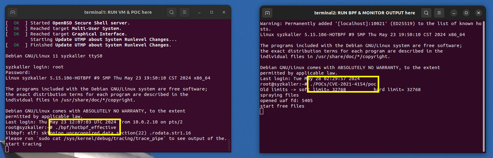

# SeaK: Rethinking the Design of a Secure Allocator for OS Kernel
<!-- Usenix Security'24 paper SeaK: Rethinking the Design of a Secure Allocator for OS Kernel

links below will be synthesized and open-source before the AE.

- Kernel: https://github.com/purplewall1206/linux-forked/tree/hotbpf
- hotbpf: https://github.com/chenyueqi/hotbpf-priv/tree/master
- analyzer: https://github.com/Markakd/hot_bpf_analyzer -->


This repo is the prototype implementation of **SeaK**, a new design of secure OS kernel heap allocator.

Compare to the previous secure kernel heap allocators, e.g., KFENCE, 
we explore a new strategy which centers around the **“atomic alleviation” (AA)** concept. 

One AA offers the most granular level of exploit alleviation by separating a specific type of kernel object.
We can orchestrate particular sets of AAs to meet distinct security needs, focusing only on critical objects instead of every object indiscriminately. 

Besides, the enforcement and retirement of AAs do not bother to recompile and reboot the kernel, supporting continuous protection upgrading.


```
@inproceedings{wang2024seak,
  title={SeaK: Rethinking the Design of a Secure Allocator for OS Kernel},
  year={2024},
  booktitle={33rd USENIX Security Symposium (USENIX Security 24)},
  author={Wang, Zicheng and Guang, Yicheng and Chen, Yueqi and Lin, Zhenpeng and Le, Michael and Le, Dang K and Williams, Dan and Xing, Xinyu and Gu, Zhongshu and Jamjoom, Hani}
}
```

-------------

*Below are the guidance for artifacts evaluation*

We design 3 sets of descriptions and experiments for applying all 3 badges.

- Artifacts Available: all documentations, code, and scripts are open-sourced. 
- Artifacts Functional: the workflow to prevent the exploitation of [CVE-2021-4154](https://github.com/Markakd/CVE-2021-4154).
- Results Reproduced: the performance and memory overhead of all experiments.

clone the repo and get start!

```sh
# clone the repo
host$ git clone --recurse-submodules -j8 git@github.com:a8stract-lab/SeaK.git

# cd into the SeaK repo
host$ cd SeaK

# download the rootfilesystem and keys for the vitual machine
cd 1-evaluation
# microsoft drive link, you should download the files one by one
https://tinyurl.com/mwsub255
```


## Artifacts Available

all documentations, code, and scripts involve with the paper and AE process are open-sourced. 

- 1-evaluation: scripts and kernel images(compressed in kernels.tar.xz) to automatically executing the evaluation. 
- 2-source-code:
    - analyzer: LLVM Pass to extract the allocation and release sites of `struct`
    - linux-5.15.106: Modified linux kernel, increase the SeaK implementation, eBPF programs, and vulnerabilities
    - POCs: exploitation writeup of `CVE-2021-4154`


## Artifacts Functional

To present the functional of the SeaK, we take CVE-2021-4154 as an example, demonstrate the workflow to create a eBPF program from scratch.

At first, system admin may receive a bug report showing the error sites and objects of the heap memory corruption.

Then, system admin use the static analysis tools `hot_bpf_analyzer` to extract the alloction and release sites of those `heap objects`

After that, SeaK generate the BPF AA(atomic Alleviation) programs by taking the allocation and release sites as paramter.

BPF AA programs are loaded in the kernel to seperate the location of `struct file` objects, and the exploitations will be prevented.

The system will not be take over, though there is proabilitity that the system may panic


### 1. analyze bug report to get the vulnerable, sensitive objects.


At the beginning we can acknowledge the vulnerability details from the bug report, here is the report of `CVE-2021-4154` from KASAN. 


```sh
[   24.527491] BUG: KASAN: use-after-free in filp_close+0x21/0xa0
...
[   24.535798] Allocated by task 1136:
[   24.536963]  __alloc_file+0x25/0x160  <-- vulnerable/sensitive object: struct file
...
[   24.538657] 
[   24.538743] Freed by task 1136:
...
[   24.539689]  kfree+0x90/0x220
[   24.539836]  put_fs_context+0x1ac/0x280  <-- vulnerable/sensitive object: struct file
[   24.540027]  fscontext_release+0x31/0x40
[   24.540223]  __fput+0x104/0x400
```

In the exploitation writeup of `CVE-2021-4154` (Thanks to [Zhenpeng Lin](https://github.com/Markakd/CVE-2021-4154))

**both the vulnerable and victim/sensitive oject is `struct file`**.

### 2. extract the allocation and release sites.

As the KASAN report has already presented the allocation and free sites of `struct file`, there's no need for further efforts to achieve AA for CVE-2021-4154.

but for other unknown vulnerabilities without KASAN reports and potential sensitive objects, we still need the static analyzer to get the allocation and release sites.

**Compiling LLVM will take up many resources (64GB RAM and 200GB disk space), evaluators can skip this process, all results are provides**

**`host$` means in the host machine, `root@docker$` means in the docker container, `root@vm$` means in the virtual machine.**


#### 2.1 build up docker image

build up the docker image from dockerfile, and share the 

```sh
# cd into the analyzer directory
host$ cd 2-source-code/analyzer

# build up the docker image from docker file
host$ docker build -t my_hotbpf_image .

# build up docker container from the image and share 2-source-code directories.
host$ docker run -it --name my_hotbpf_container -v $(pwd)/../:/home/hotbpf/ my_hotbpf_image
```


#### 2.2 compile the specific LLVM compiler and the analyzer

compile the specific LLVM compiler and the analyzer in the docker container.

```sh
# run the container bash
host$ docker exec -it my_hotbpf_container /bin/bash

# compile the specific LLVM compiler in the container (may enormous resources and time) 
root@docker$ $BUILD_LLVM

# compile the analyzer in the container
root@docker$ $BUILD_ANALYZER
```


#### 2.3 compile the kernel with the specific LLVM compiler (IR files are provided)

**note that the IR files for static analysis has been provided in the 2-source-code/linux-5.15.106/(\*.c.bc), evaluators can skip this process**

compile the kernel to get LLVM IR files for static analysis.

```sh
# compile the kernel to the IR files
root@docker$ ./build-kernel.sh
```

we may see `*.c.bc` files in all directories.

```sh
root@docker$ ls /home/hotbpf/linux-5.15.106/kernel/*.bc
kernel/acct.c.bc            kernel/cpu.c.bc          kernel/hung_task.c.bc   
kernel/kthread.c.bc           kernel/range.c.bc       kernel/static_call.c.bc         
kernel/umh.c.bc           kernel/async.c.bc           kernel/crash_core.c.bc 
...
```

#### 2.4 run the static analyzer to get the allocation sites

```sh
# the allocation and free sites of struct file
root@docker$ /home/hotbpf/analyzer/build/lib/analyzer -struct file `find /home/hotbpf/linux-5.15.106/fs -name "*.bc"`

dumping location of allocating file
__alloc_file fs/file_table.c:101  <-- real allocation site!
Possible Caller for __alloc_file
alloc_empty_file
alloc_empty_file_noaccount

dumping location of freeing file 
__free_fdtable fs/file.c:36 <-- false positive
Possible Caller for __free_fdtable
dup_fd
dup_fd
put_files_struct
expand_fdtable
free_fdtable_rcu

alloc_fdtable fs/file.c:155  <-- false positive
Possible Caller for alloc_fdtable
dup_fd
expand_fdtable

file_free_rcu fs/file_table.c:50 <-- real release site!
Possible Caller for file_free_rcu
__alloc_file
```


#### 2.5 generate and compile the BPF program

**the prepared file is in `2-source-code/linux-5.15.106/sample/bpf/hotbpf_effective_user/kern.c`, `Makefile` is also prepared**

generate BPF AA program for 

```sh
# exit analyzer directory to the 2-source-code
host$ cd ../

# generate AA code
host$ python3 gen_hotbpf.py -name effective -alloc __alloc_file -free file_free_rcu

# copy code in the BPF compilation directory
host$ mv hotbpf_effective_user.c linux-5.15.106/samples/bpf/
host$ mv hotbpf_effective_kern.c linux-5.15.106/samples/bpf/

# compile kernel first.
host$ cd linux-5.15.106
host$ make -j8 bzImage

# get into the BPF compilation directory
host$ cd samples/bpf/
```


In the compilation directory, modify the `Makefile`, add necessary compilation commands.

```patch

...
tprogs-y +=hotbpf_cred
tprogs-y +=hotbpf_fdtable
+ tprogs-y +=hotbpf_effective
...

hotbpf_cred-objs := hotbpf_cred_user.o
hotbpf_fdtable-objs := hotbpf_fdtable_user.o
+ hotbpf_effective-objs := hotbpf_effective_user.o
...

always-y += hotbpf_cred_kern.o
always-y += hotbpf_fdtable_kern.o
+ always-y += hotbpf_effective_kern.o
...
```

Compile all BPF programs.

```sh
host$ make -j8
```


#### 2.6 boot up virtual machine and evaluate.

cd into evaluate directory, boot up the virtual machine, 2 terminals pop out, insert `root` to login in the left terminal.

```sh
host$ cd $PATH_TO_SEAK/SeaK/1-evaluation
host$ ./evaluate.sh
```


execute BPF programs to prevent the vulnerability on the left terminal `root@vm$ ./bpf/hotbpf_effective ` first

execute POCs programs to exploit the `CVE-2021-4154` on the right terminal
```sh
# add a normal user to execute POC, set passwd to `evaluate` too
root@vm$ adduser evaluate

# copy POCs to evaluate directory
root@vm$ cp -r POCs /home/evaluate/

# set permission
root@vm$ chown -R evaluate:evaluate /home/evaluate/POCs

# change to evaluate
evaluate@vm$ su evaluate

# cd to CVE-2021-4154 directory
evaluate@vm$ cd /home/evaluate/POCs/CVE-2021-4154

# compile and execute
evaluate@vm$ make && ./poc
```

After the attack, we can see the system is still functioning, **but the POCs cannot get `/bin/bash` shell**

now shut down the left and right terminal to continue.




## Results Reproduced

To prove the results can be reproduced, we design 2 experiments.

To make the experiments process easier, we provides virtual machines to accelerate the evaluations, but the whole process may still take more than 20 hours.

### 1.overhead of existing features

In our paper, we state that C1 and C2 have little overhead but they fail to protect the kernel heap. C3 is able to protect the kernel heap but its overhead can't be ignored. In this part, we will show how to reproduce the overhead of C1, C2 and C3.

For benchmarks, we will use lmbench and phoronix-test-suite as stated in our paper.

#### 1.1 measure the overhead of vanilla

Then execute evaluate-vanilla.sh and log in the virtual machine.

```bash
host$ ./evaluate-vanilla.sh
```

In the virtual machine, run commands below:

```bash
# easy for you to view the command and output
root@vm$ screen
# make sure everything is up-to-date
root@vm$ phoronix-test-suite install sqlite-speedtest apache osbench ffmpeg sockperf compress-7zip openssl redis
root@vm$ cd scripts
#some basic setups
root@vm$ ./set_up.sh
root@vm$ ./EF_vanilla.sh
```

After setup，make sure there are these directories under /root


#### 1.2 measure the overhead of C1

First, close the virtual machine and execute evaluate-C1.sh and log in the virtual machine.

```bash
host$ ./evaluate-C1.sh
```

In the virtual machine, run commands below:

```bash
# easy for you to view the command and output
root@vm$ screen
root@vm$ cd scripts
root@vm$ ./EF_C1.sh
```

#### 1.3 measure the overhead of C2

First, close the virtual machine and execute evaluate-C2.sh and log in the virtual machine.

```bash
host$ ./evaluate-C2.sh
```

In the virtual machine, run commands below:

```bash
# easy for you to view the command and output
root@vm$ screen
root@vm$ cd scripts
root@vm$ ./EF_C2.sh
```

#### 1.4 measure the overhead of C3

First, close the virtual machine andexecute evaluate-C3.sh and log in the virtual machine.

```bash
host$ ./evaluate-C3.sh
```

In the virtual machine, run commands below:

```bash
# easy for you to view the command and output
root@vm$ screen
root@vm$ cd scripts
root@vm$ ./EF_C3.sh
```

#### 1.5 analyze the raw data

run command:

```bash
root@vm$ ./EF_analysis.sh
```

By executing this command, EF_lmbench.xlsx, EF_phoronix.xlsx and EF_memory_overhead.pdf counld be found under /root/Results.

### 2. overhead of SeaK

In our paper, we state that the overhead SeaK is negligible. In this part, we will show how to reproduce the results of SeaK. Benchmarks are also lmbench and phoronix-test-suite.

#### 2.1 measure the overhead of SeaK

First,close the virtual machine and execute evaluate-SeaK.sh and log in the virtual machine.

```bash
host$ ./evaluate-SeaK.sh
```

In the virtual machine, run commands below (this command will take at least 12 hours):

```bash
# easy for you to view the command and output
root@vm$ screen
root@vm$ cd scripts
root@vm$ ./SeaK.sh
```

#### 2.2 analyze the raw data

run command:

```bash
root@vm$ ./SeaK_analysis.sh
```

By executing this command, SeaK_lmbench.xlsx, SeaK_phoronix.xlsx and SeaK_memory_overhead.pdf could be found under /root/Results.


### 3.How to view the results

The virtual machine does not support pdf and xlsx. So you can use ssh to transit the results to the host machine.

First, get the hostip of your machine:

```bash
host$ ifconfig
```

Run commands like this:

```bash
root@vm$ scp -r /root/Results hostname@hostip:/path/to/host/directory
```

For the pdf files of memory overhead, you may find the graphs are too small or too big. You can modify the parameters 'length' and 'height' in EF_memory_overhead.py and SeaK_memory_overhead.py.


After modifying the python file, run `python3 EF_memory_overhead.py` or `python3 SeaK_memory_overhead.py` to regenerate the pdf files with proper size.


## Possible problems you may encounter

1. When you execute shell scripts like "evaluate.sh", you may see "Permission denied". In this case, you should execute :

   ```bash
   host$ chmod +x target_script.sh
   ```

2. You may see error returns when you execute "evaluate.sh" like:

   ```bash
   Permissions 0644 for 'bullseye.id_rsa' are too open
   ```

   In this case, you should execute:

   ```bash
   host$ chmod 0600 bullseye.id_rsa
   ```

   
